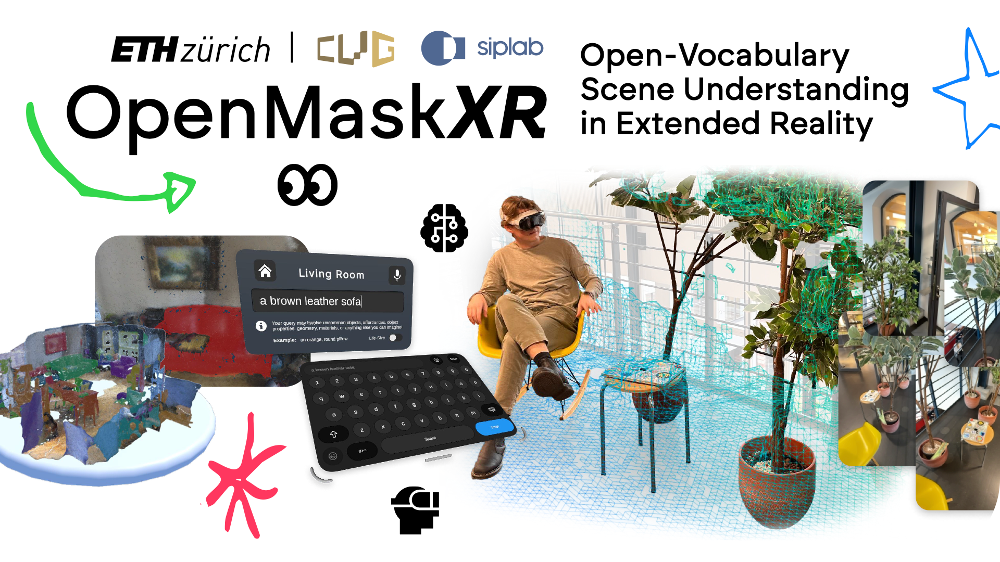
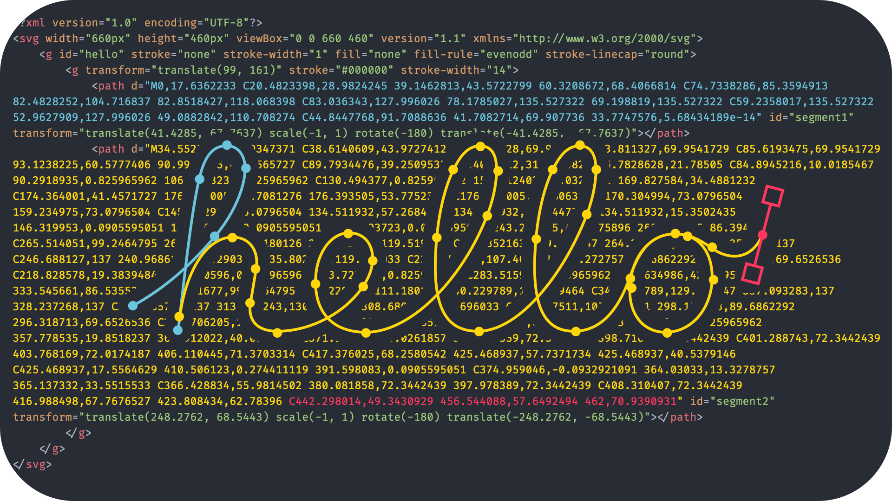

### Caffeinated Greetings 👋

I'm a Master’s Student in Computer Science at [ETH Zürich](https://inf.ethz.ch) and a researcher in Human-Centered Computing, focusing on Computational Interaction 🦾, User ğŸ§ and World ğŸŒ Modeling, and Accessibility ğŸ‘ for Extended Reality ğŸ‘“ (XR).

#### Recent Public Releases

- 👀 Open-vocabulary scene understanding for commodity XR via [OpenMaskXR](https://github.com/AlexLike/OpenMaskXR), now with a video figure:  
- 🖱️ A short primer on [output-directed programming](https://github.com/AlexLike/ETH-UCPI24/blob/main/topics/w5-direct-manipulation.md):  
- ✍️ Applying user-centered design to help cartoon artists in the age of digital. [Flex Studio](https://github.com/AlexLike/FlexStudio):  

Browse my 🧑‍💻 [GitHub](https://github.com/AlexLike) and 📹 [YouTube](https://www.youtube.com/@alexlike) channel for more. Interested in collaborating? Let's connect! Send me a message on [LinkedIn](https://www.linkedin.com/in/alzank/) or via e-mail 🙃.

xoxo, Alex 🦄
